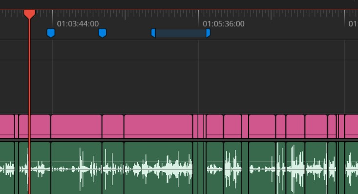

# DaVinci Resolve Marker Manager
Allows you to quickly create render jobs based on timeline markers.

**Please note this is a rough and early version of this script and might be buggy, use at your own risk.**

## Installation
Copy the python script to this location:

Mac OS X:
- All users: /Library/Application Support/Blackmagic Design/DaVinci Resolve/Fusion/Scripts/Edit
- Specific user: /Users/<UserName>/Library/Application Support/Blackmagic Design/DaVinci Resolve/Fusion/Scripts/Edit

Windows:
- All users: %PROGRAMDATA%\Blackmagic Design\DaVinci Resolve\Fusion\Scripts\Edit
- Specific user: %APPDATA%\Blackmagic Design\DaVinci Resolve\Support\Fusion\Scripts\Edit

Linux:
- All users: /opt/resolve/Fusion/Scripts/Edit __(or /home/resolve/Fusion/Scripts/Edit depending on installation)__
- Specific user: $HOME/.local/share/DaVinciResolve/Fusion/Scripts/Edit

## Usage
- From the Edit page, click on Workspace -> Scripts -> MarkerMan
- Select the color of marker you're using on the timeline to mark clips with.

## Changelog
0.1.1
- First rough release, super basic functionality based on a script I wrote in 2023 to bulk-export theatre clips from Resolve.
